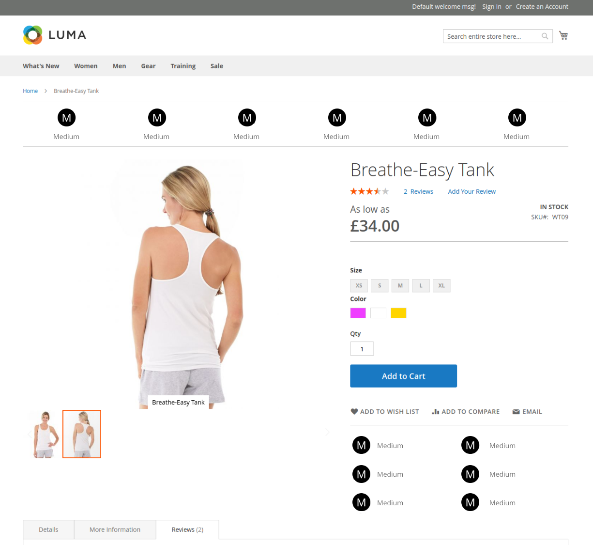

# Magento 2 Product Icons

This is an extension for Magento 2 ONLY. It allows you to display Icons in places on the product page. These icons are set on your products via attributes. Ideally you would choose via this extensions config to disable one of the areas which displays the icons on the product page otherwise the icons will display twice but in a different style. A image below shows an example of the layout. Icons ovbiously would be different and not all the same



## Using the extension

I recommend you fork the extension files to your own github account and then modify to your own needs. The code comes with one sample Icon and will require some development knowledge to to set up more.

After cloning the fork from your account into the folder ```app/code/TPB/ProductIcons``` you really want to set up all the product icons you want before you run ```php bin/magento setup:upgrade```

To set up the extensions with your own attributes to use as icons youll need to copy the already existing Size attribute class located at ```Attributes/Size.php``` to something that represents the name of your new one. Once editing your new copy of this class you will see you need to change the following things:

### ATTR_CODE

This is the code that the attribute is refered to as in magento behind the scenes, it is also used as the directory name to find the icon in the images directory.

### ATTR_LABEL

This is the label of the attribute, this would be something categorizing the options related to the attribute, for instance, size, weight, length, height, country, and so on.

### ATTR_GROUP_NAME

This is the name of the group where the attributes will appear in the add/edit product area in magentos admin. It can be anything you like be ideally should be the same for each attribute so you can find all icon related ones easily.

### ATTR_CONFIG_CODE

This is the code of the config value used to determine wether this attribute will display its icon in the block on the frontend. It can be anything you like but must match how its set up in the files in the ```etc``` folder of this module

### getAttributeOptions()

Here you should be able to see how to change the values of this array and add new values to create options for your attribute. The keys to each option (option_0) must be a string and not integers or else they will not be created on first use of this module, god knows why. Each option has a value for key 0 and for key 1. 0 is what is displayed in the admin panel and 1 is displayed on the default frontend store. More stores will have to be configured via the admin panel.

### getIconFileNameByAttributeLabel()

This is where you match the option name selected with a file name of the image stored in your images directory. Remember they are already expecting to be found in the ATTR_CODE directory so you only need to worry about the file name.

### Loading the attributes

In the file ```Attributes/AttributeConfig.php`` add your new attribute class in the same manner as the size class has been added to the ATTR_CONFIG const array.

### Seting up admin panel config items

Next we need to address the configuration of these attributes in the admin panel. In ```etc/adminhtml/system.xml``` theres already a sample configuration for the size attribute so copy that xml node and change its values according to your new attribute yopu need to configure. Obviously the field ID would be the same as the ATTR_CONFIG_CODE from your attribute class and so on. These config items you are adding are designed to simply hide or show the attributes from the frontend.

Next in ```etc/config.xml``` make sure you add a default value for your newly added admin config item, usually it will be 1. As you can see for the size attribute there is an example for you already.

## Ready to Go

Once all your attributes are set up in the codebase commit them back to your forked repository to keep them safe.

- Then run ```php bin/magento cache:clean```
- Then run ```php bin/magento setup:upgrade```

This should create the attributes in the database and enable the blocks. As default the top bar will be visible on product pages and the product info one will be hidden unless you have changed that. You will be able to choose an option for that attribute when editing a product and then when visiting a product page the icons related to those settings will be displayed.

# Support

> - NOTE: This extension is provided under the MIT license and I do not accept any responsability for any problems you encounter when using it
> - NOTE: I recommend for design purposes using no more that 6 attributes without modifications to the CSS and block layout
> - NOTE: This was designed for the LUMA theme and works fine with Magento 2 out of the box, I cannot help with any situations where the extension does not work with a custom theme or has conflicting extensions

If you have any questions or improvment suggestions please submit them as an issue. Any bugs you find then also please submit them as an issue with a detailed explination of how to replicate the problem and I will endevour to do my best to help.
